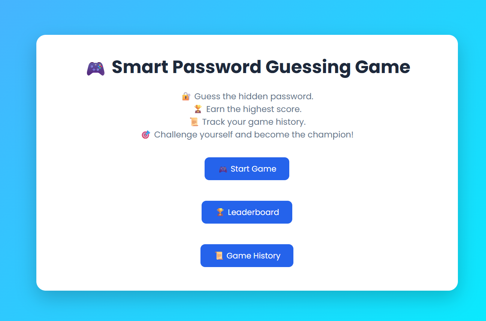
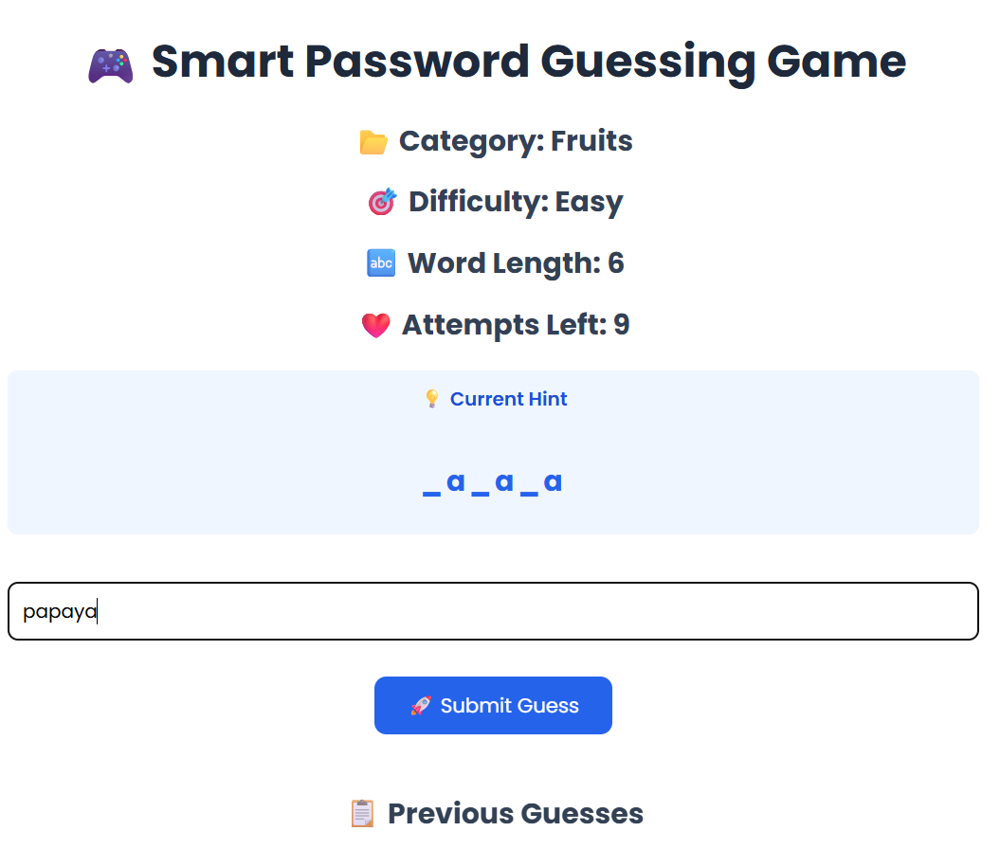
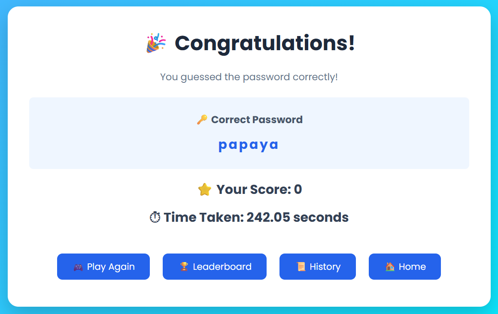
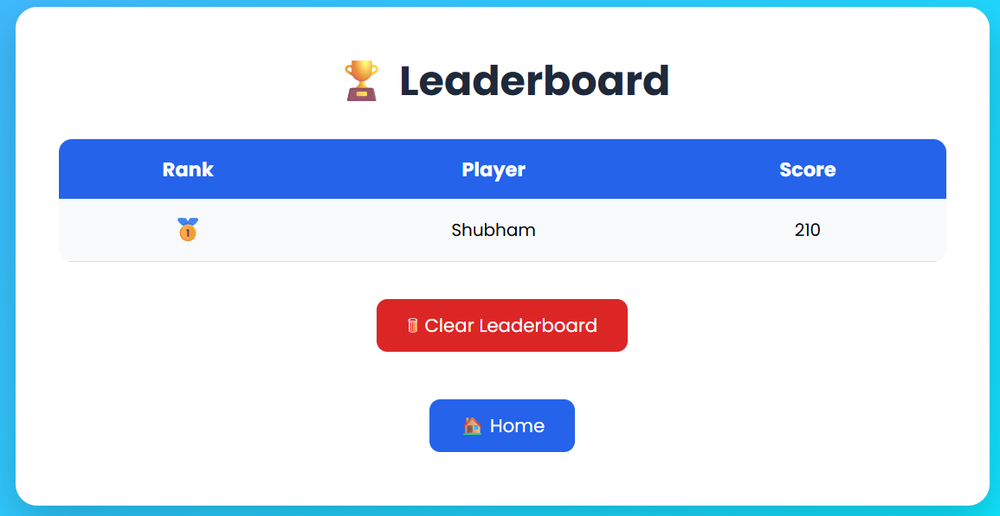
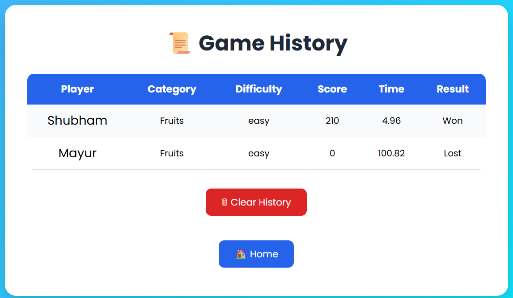
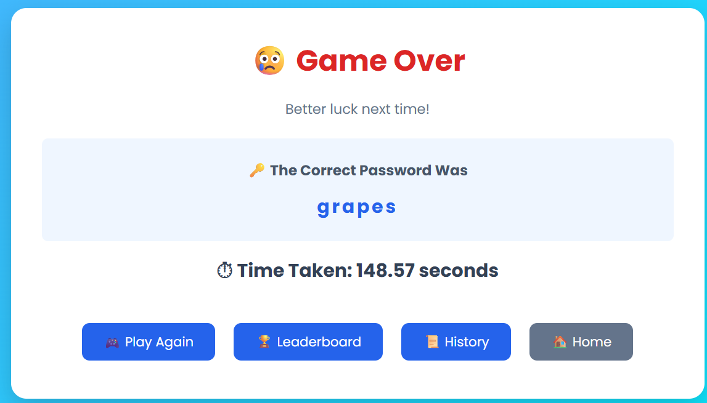

# 🔐 Smart Password Guessing Game

## 🌐 Live Demo

👉 **[Play the Game Here](https://smart-password-guessing-game.onrender.com)**


A web-based password guessing game developed using **Python** and **Flask**. The application provides an interactive experience where players guess hidden words from different categories while earning points based on their performance.

# 📌 Project Overview

The Smart Password Guessing Game is designed to make word guessing fun and engaging. Players can choose different categories and difficulty levels, receive hints, track their scores, and view previous game history.

The project helped me strengthen my understanding of:

- Python Programming
- Flask Web Development
- HTML & CSS
- File Handling
- Git & GitHub

# ✨ Features

- 🎯 Multiple Categories
  - Fruits
  - Animals
  - Countries
  - Technology
  - Movies

- 🎮 Three Difficulty Levels
  - Easy
  - Medium
  - Hard

- 💡 Smart Hint System

- 🏆 Dynamic Score Calculation

- 📈 Leaderboard

- 📜 Game History

- ✅ Input Validation

- ⏱️ Timer Based Scoring

- 🧹 Clear Leaderboard

- 🗑️ Clear History


# 🛠️ Technologies Used

- Python
- Flask
- HTML5
- CSS3
- File Handling
- Git
- GitHub

## 🚀 Installation

### Clone the Repository

```bash
git clone https://github.com/Shubham-91S/Smart-Password-Guessing-Game.git
```

### Navigate to the Project Folder

```bash
cd Smart-Password-Guessing-Game
```

### Install Dependencies

```bash
pip install -r requirements.txt
```

### Run the Application

```bash
python app.py
```

## 🎮 How to Play

1. Enter your name.
2. Choose a category.
3. Select a difficulty level.
4. Guess the hidden word.
5. Use hints if required.
6. Earn points based on your performance.
7. View your score in the leaderboard.

## 📂 Project Structure

```text
Smart-Password-Guessing-Game/
│
├── app.py
├── game.py
├── words.py
├── score.py
├── leaderboard.py
├── history.py
├── leaderboard.txt
├── history.txt
├── requirements.txt
├── .gitignore
├── README.md
│
├── templates/
│   ├── index.html
│   ├── start.html
│   ├── play.html
│   ├── win.html
│   ├── gameover.html
│   ├── leaderboard.html
│   └── history.html
│
├── static/
│   └── css/
│       └── style.css
│
└── screenshots/
    ├── home.png
    ├── start.png
    ├── play.png
    ├── win.png
    ├── leaderboard.png
    ├── history.png
    └── gameover.png
```

## 📸 Screenshots

### 🏠 Home



### ▶️ Start


### 🎮 Gameplay



### 🎉 Win



### 🏆 Leaderboard



### 📜 History



### ❌ Game Over



## 👨‍💻 Author
Shubham Khedkar

- GitHub: https://github.com/Shubham-91S
- LinkedIn: https://www.linkedin.com/in/shubham-khedkar-60b29240a


⭐ If you like this project, consider giving it a **Star** on GitHub!

Thank you for visiting my repository. 😊